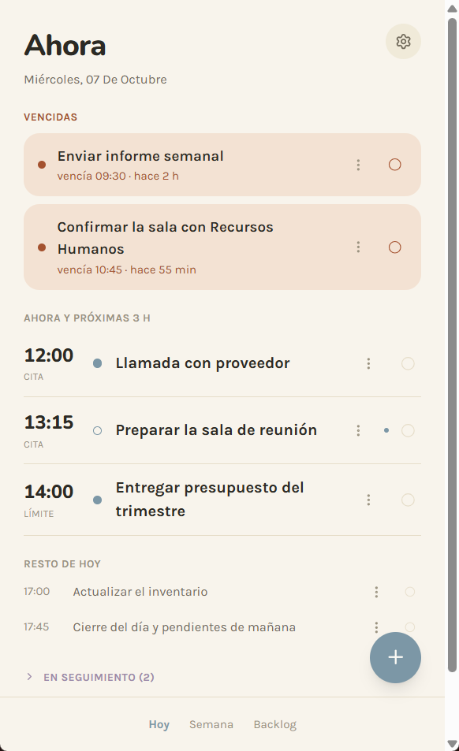
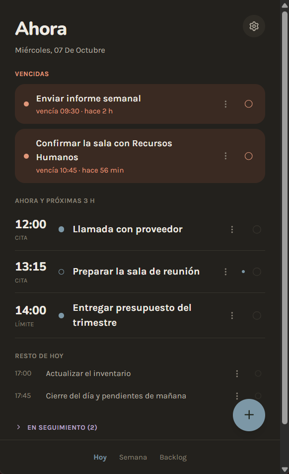
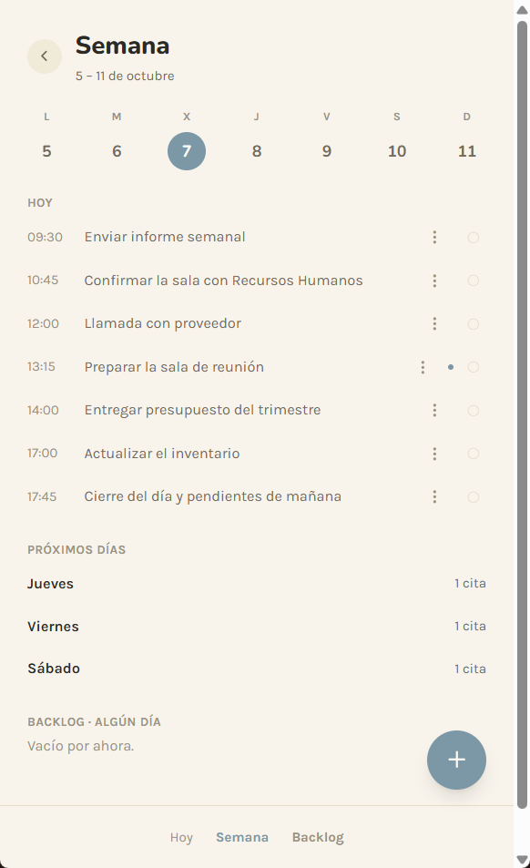
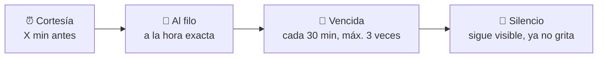
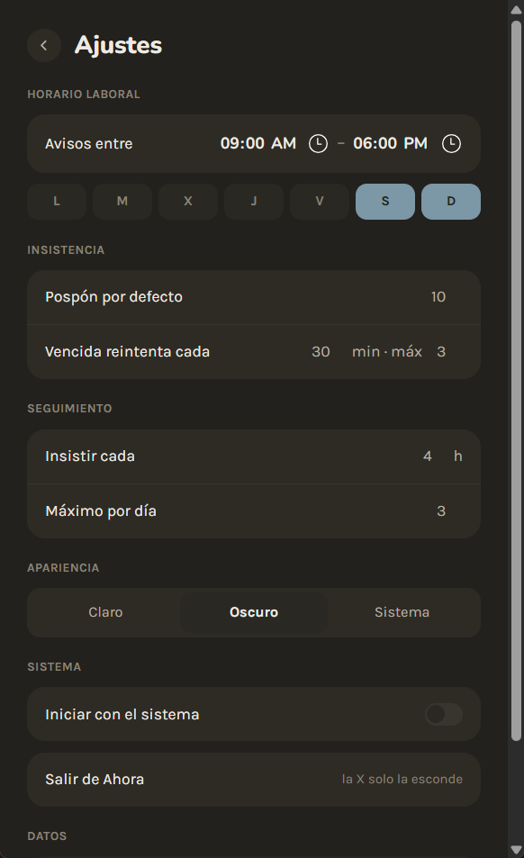

<div align="center">

# Ahora

### Tu agenda no debería esperar a que la abras.

**Ahora** es una agenda personal de escritorio que te habla:<br/>
_"esto ahora"_ · _"en 20 minutos, esto"_ · _"esto se te venció"_.


<br/>


&nbsp;

&nbsp;


<sub>Sin servidor · sin cuentas · sin nube. Todo vive en tu máquina.</sub>

</div>

---

## Nada de tableros que consultas

Las agendas normales son pasivas: están ahí _si te acuerdas de abrirlas_. Y en una oficina, con quince cosas a la vez, no te acuerdas.

**Ahora** invierte eso. Es una voz activa que te da un toque en el momento justo y te deja responder en dos segundos:

> **Hecho** · **Pospón 10 min** · **Hoy no**

Solo existe una pregunta que importa: **¿qué toca ahora?**

## Habla poco, y habla bien

Cualquiera que interrumpe demasiado acaba en silencio. Por eso **Ahora** se toma en serio _cuándo_ hablar: los avisos escalan y después se rinden con dignidad.



Nunca suena fuera de tu horario laboral. El reintento infinito es exactamente lo que hace que la gente mate la app.

## Qué es

- 📌 **Agenda y tareas en una.** Una cita ocurre a una hora; una tarea hay que terminarla _antes de_ una hora. **Ahora** entiende la diferencia sin que elijas un "tipo" en ningún menú.
- 🔁 **Tareas recurrentes que no creas a mano.** Defines la regla una vez ("revisar correo cada día a las 9") y aparece sola. Si un día no la haces, **no se acumula**: mañana hay otra y punto. La culpa acumulada es ansiedad, no productividad.
- ⚡ **Crear algo cuesta segundos.** Escribes una línea ("llamar a Juan mañana 15:00") y la app hace el resto.
- 👀 **Seguimiento sin alarma.** Para lo que esperas de otra persona (_"esperando a Google"_) hay un tono distinto: espaciado, sin rojo, para no perder el hilo.
- 🔒 **Todo local.** Tus datos viven en un SQLite en tu máquina. No se comparte nada, no hay servidor que se caiga, no hay cuenta que crear.
- 🫥 **Vive en la bandeja.** La X esconde la ventana; la app sigue avisando hasta que le dices "Salir".

## Qué NO es

No es un gestor de proyectos. No es una herramienta de equipo. No es control de horas ni facturación. No es un CRM ni una bandeja de correo. No es tu segundo cerebro. Hace **una cosa** y la hace sin estorbar.

## Un vistazo

<table>
  <tr>
    <td width="33%" valign="top">
      <b>Ahora y a continuación</b><br/><br/>
      Una sola lista ordenada por tiempo: lo vencido arriba, lo que viene en las próximas 3 horas como foco, y el resto del día compacto. En un día normal, sin scroll.
    </td>
    <td width="33%" valign="top">
      <b>Semana</b><br/><br/>
      Los siete días a un toque, lo que viene después y el backlog de "algún día". Nunca en primer plano: está ahí si lo buscas.
    </td>
    <td width="33%" valign="top">
      <b>Ajustes</b><br/><br/>
      Tu horario laboral, cuánto insiste cada aviso, el tema claro u oscuro y si arranca con el sistema.
    </td>
  </tr>
  <tr>
    <td></td>
    <td></td>
    <td></td>
  </tr>
</table>

## Estado

🌱 **Alpha funcional.** Todo lo de arriba anda hoy: avisos escalonados con horario laboral, recurrentes, captura rápida, ítems en seguimiento, bandeja, notificaciones nativas, autostart y tema claro/oscuro, con tests del frontend y del shell.

Lo que falta:

- ⬜ **Instalador.** Por ahora la app se lanza desde el código con `npm run app`. Ver [docs/DESARROLLO.md](docs/DESARROLLO.md#empaquetado).
- ⬜ **Ícono propio.** El de la bandeja es todavía un marcador de posición.

## Probarla

Necesitas [Node.js](https://nodejs.org) 20+ y [Python](https://python.org) 3.11+ en Windows.

```bash
npm install
python -m venv shell/.venv
shell\.venv\Scripts\pip install -r shell\requirements.txt

npm run app:build   # compila la interfaz y abre Ahora
```

Las siguientes veces basta con `npm run app`.

Todo el detalle para desarrollar está en **[docs/DESARROLLO.md](docs/DESARROLLO.md)**.

## Cómo se hace

Ahora lo desarrolla **Fredo** junto con dos agentes de IA, cada uno con su rol:

|                                                               | Rol                                                                                  |
| ------------------------------------------------------------- | ------------------------------------------------------------------------------------ |
| 🧑‍💻 **Fredo**                                                  | Dirección del producto y última palabra                                              |
| 🤖 **[Claude](https://www.anthropic.com/claude)** (Anthropic) | Dirige junto a Fredo, diseña los cambios y revisa el código antes de darlo por bueno |
| 🤖 **[OpenCode](https://opencode.ai)**                        | Implementa el código a partir de las tareas de cada cambio                           |

Los cambios se proponen con OpenSpec, se verifican con `npm run ci` y el historial de git lo escriben solo Fredo o Claude. El flujo completo está en [CONTRIBUTING.md](CONTRIBUTING.md).

## Documentación

| Documento                                | Para qué sirve                                                               |
| ---------------------------------------- | ---------------------------------------------------------------------------- |
| [docs/FILOSOFIA.md](docs/FILOSOFIA.md)   | El documento norte: qué es, qué se niega a ser, cómo se comportan los avisos |
| [docs/DESARROLLO.md](docs/DESARROLLO.md) | Stack, estructura, el puente con Python, tests y plataformas                 |
| [CONTRIBUTING.md](CONTRIBUTING.md)       | Ramas, commits, PRs y el trabajo con agentes                                 |
| [CLAUDE.md](CLAUDE.md)                   | Guía para agentes: comandos, trampas conocidas y reglas                      |

## Licencia

Proyecto interno. Todos los derechos reservados.
